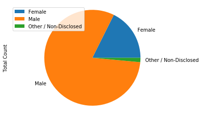
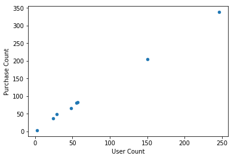
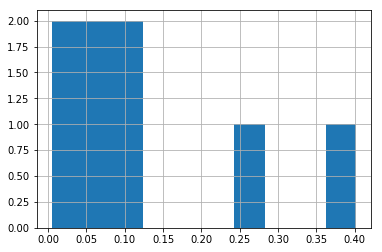
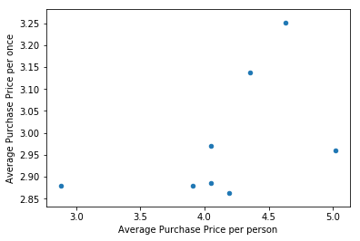
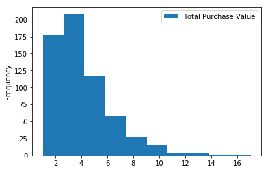
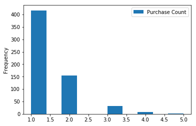
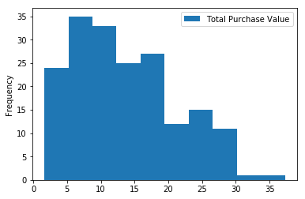
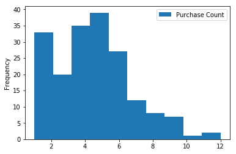
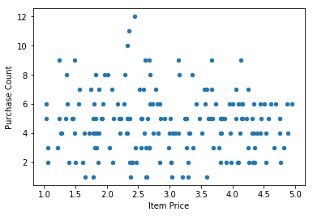
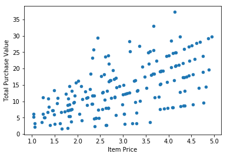

# Heroes of Pymoli Data Analysis

## three observable trends based on the data
1. [User demographics] Early twenty player is the largest number(around 40%), late teen players are following (around 25%). Male players are more than 80%(N=612).

2. [the number of Item(s) users have] User count and total purchase count are strongly positive coefficient. It is assumed that most users have only 1 item. It is also supported by that more than 60% of users bought only 1 item, 25% of users boutht 2 items(N=858).

3. [Popular Item] No particular correlation between Item Price and the number of item sold.


```python
# Import Dependencies
import pandas as pd
import os
import mimetypes
from functools import reduce

# Path to resource files
path = "resources"

# Get a file name list
fileList = [f for f in os.listdir(path) if (mimetypes.guess_type(f)[0] == "application/json")]
# print(fileList)

def mergeDF(directory, fileArr):
    dfArr = []    
    if len(fileArr) > 1:
        for file in fileArr:
            dfArr.append(pd.read_json(os.path.join(directory, file)))
        df = reduce(lambda  left,right: pd.merge(left,right,how='outer'), dfArr)
    else:
        df = pd.read_json(os.path.join(directory, fileArr[0]))
    return df

# Create references to the json files and import it into a marged Pandas DataFrame
purchase_df = mergeDF(path, fileList)
# purchase_df
```

## Player Count


```python
# Count the number of total players
totalCount = purchase_df["SN"].value_counts().count()
pd.DataFrame({"Total Players": [totalCount]})
```


<div>
<style>
    .dataframe thead tr:only-child th {
        text-align: right;
    }

    .dataframe thead th {
        text-align: left;
    }

    .dataframe tbody tr th {
        vertical-align: top;
    }
</style>
<table border="1" class="dataframe">
  <thead>
    <tr style="text-align: right;">
      <th></th>
      <th>Total Players</th>
    </tr>
  </thead>
  <tbody>
    <tr>
      <th>0</th>
      <td>612</td>
    </tr>
  </tbody>
</table>
</div>


## Purchasing Analysis (Total)


```python
# Create a new df with formatting
purchasingAnalysis_df = pd.DataFrame({
    "Number of Unique Items":[purchase_df["Item ID"].value_counts().count()],
    "Average Purchase Price":["$" + str(round(purchase_df["Price"].mean(),2))],
    "Total Number of Purchases":[len(purchase_df.index)],
    "Total Revenue":["$" + str(round(purchase_df["Price"].sum(),2))]
})

# Output
purchasingAnalysis_df[[
    "Number of Unique Items",
    "Average Purchase Price",
    "Total Number of Purchases",
    "Total Revenue"
]]
```


<div>
<style>
    .dataframe thead tr:only-child th {
        text-align: right;
    }

    .dataframe thead th {
        text-align: left;
    }

    .dataframe tbody tr th {
        vertical-align: top;
    }
</style>
<table border="1" class="dataframe">
  <thead>
    <tr style="text-align: right;">
      <th></th>
      <th>Number of Unique Items</th>
      <th>Average Purchase Price</th>
      <th>Total Number of Purchases</th>
      <th>Total Revenue</th>
    </tr>
  </thead>
  <tbody>
    <tr>
      <th>0</th>
      <td>184</td>
      <td>$2.93</td>
      <td>858</td>
      <td>$2514.43</td>
    </tr>
  </tbody>
</table>
</div>


## Gender Demographics


```python
# Create a new df removed duplicated "SN"
uniquePlayers_df = purchase_df[~purchase_df["SN"].duplicated()]
# uniquePlayers_df

# Group by gender
gender = uniquePlayers_df.groupby("Gender")

# Create a new df
gender_df = pd.DataFrame({
    "Percentage of Players": gender["Age"].count()/totalCount,
    "Total Count":gender["Age"].count()
})

# Format
gender_df["Percentage of Players"] = gender_df["Percentage of Players"].map("{:.2%}".format)

# Sort and Output
gender_df.sort_values(by="Total Count",ascending=False)
```


<div>
<style>
    .dataframe thead tr:only-child th {
        text-align: right;
    }

    .dataframe thead th {
        text-align: left;
    }

    .dataframe tbody tr th {
        vertical-align: top;
    }
</style>
<table border="1" class="dataframe">
  <thead>
    <tr style="text-align: right;">
      <th></th>
      <th>Percentage of Players</th>
      <th>Total Count</th>
    </tr>
    <tr>
      <th>Gender</th>
      <th></th>
      <th></th>
    </tr>
  </thead>
  <tbody>
    <tr>
      <th>Male</th>
      <td>80.88%</td>
      <td>495</td>
    </tr>
    <tr>
      <th>Female</th>
      <td>17.65%</td>
      <td>108</td>
    </tr>
    <tr>
      <th>Other / Non-Disclosed</th>
      <td>1.47%</td>
      <td>9</td>
    </tr>
  </tbody>
</table>
</div>


```python
%matplotlib inline
gender_df.plot.pie("Total Count").axis("equal")
```


    (-1.1056525356513272,
     1.1002691684587598,
     -1.1061276225600638,
     1.1053838469607085)


## Purchasing Analysis (Gender)


```python
# Create a new df
purchasing_gender_df = pd.DataFrame({
    "Purchase Count": gender_df["Total Count"],
    "Average Purchase Price":gender["Price"].mean(),
    "Total Purchase Value":gender["Price"].sum(),
    "Normalized Totals":gender["Price"].mean()*gender["Price"].std()
})

#Format and Output
purchasing_gender_df[[
    "Purchase Count",
    "Average Purchase Price",
    "Total Purchase Value",
    "Normalized Totals"
]].style.format({
    "Average Purchase Price":"${:.2f}",
    "Total Purchase Value":"${:.2f}",
    "Normalized Totals":"${:.2f}"
})
```


<style  type="text/css" >
</style>  
<table id="T_1909c5b6_1fb7_11e8_bfa2_1a00d4419701" > 
<thead>    <tr> 
        <th class="blank level0" ></th> 
        <th class="col_heading level0 col0" >Purchase Count</th> 
        <th class="col_heading level0 col1" >Average Purchase Price</th> 
        <th class="col_heading level0 col2" >Total Purchase Value</th> 
        <th class="col_heading level0 col3" >Normalized Totals</th> 
    </tr>    <tr> 
        <th class="index_name level0" >Gender</th> 
        <th class="blank" ></th> 
        <th class="blank" ></th> 
        <th class="blank" ></th> 
        <th class="blank" ></th> 
    </tr></thead> 
<tbody>    <tr> 
        <th id="T_1909c5b6_1fb7_11e8_bfa2_1a00d4419701level0_row0" class="row_heading level0 row0" >Female</th> 
        <td id="T_1909c5b6_1fb7_11e8_bfa2_1a00d4419701row0_col0" class="data row0 col0" >108</td> 
        <td id="T_1909c5b6_1fb7_11e8_bfa2_1a00d4419701row0_col1" class="data row0 col1" >$2.93</td> 
        <td id="T_1909c5b6_1fb7_11e8_bfa2_1a00d4419701row0_col2" class="data row0 col2" >$316.62</td> 
        <td id="T_1909c5b6_1fb7_11e8_bfa2_1a00d4419701row0_col3" class="data row0 col3" >$3.30</td> 
    </tr>    <tr> 
        <th id="T_1909c5b6_1fb7_11e8_bfa2_1a00d4419701level0_row1" class="row_heading level0 row1" >Male</th> 
        <td id="T_1909c5b6_1fb7_11e8_bfa2_1a00d4419701row1_col0" class="data row1 col0" >495</td> 
        <td id="T_1909c5b6_1fb7_11e8_bfa2_1a00d4419701row1_col1" class="data row1 col1" >$3.00</td> 
        <td id="T_1909c5b6_1fb7_11e8_bfa2_1a00d4419701row1_col2" class="data row1 col2" >$1486.37</td> 
        <td id="T_1909c5b6_1fb7_11e8_bfa2_1a00d4419701row1_col3" class="data row1 col3" >$3.31</td> 
    </tr>    <tr> 
        <th id="T_1909c5b6_1fb7_11e8_bfa2_1a00d4419701level0_row2" class="row_heading level0 row2" >Other / Non-Disclosed</th> 
        <td id="T_1909c5b6_1fb7_11e8_bfa2_1a00d4419701row2_col0" class="data row2 col0" >9</td> 
        <td id="T_1909c5b6_1fb7_11e8_bfa2_1a00d4419701row2_col1" class="data row2 col1" >$3.30</td> 
        <td id="T_1909c5b6_1fb7_11e8_bfa2_1a00d4419701row2_col2" class="data row2 col2" >$29.70</td> 
        <td id="T_1909c5b6_1fb7_11e8_bfa2_1a00d4419701row2_col3" class="data row2 col3" >$2.79</td> 
    </tr></tbody> 
</table> 


## Age Demographics


```python
# Set bins and labels
# print(purchase_df["Age"].min())
# print(purchase_df["Age"].max())
bins = [0,10,15,20,25,30,35,40,45]
group_labels = ["< 10","10 - 14","15 - 19","20 - 24","25 - 29","30 - 34","35 - 39","40 - 45"]
uniquePlayers_df["ageRange"] = pd.cut(uniquePlayers_df["Age"],bins,labels=group_labels)
# uniquePlayers_df.head()

# Group by ageRange
uniquePlayers_ageRange = uniquePlayers_df.groupby("ageRange")

# Format and Output
uniquePlayers_ageRange_df = pd.DataFrame({
    "Percentage of Players":uniquePlayers_ageRange["Age"].count()/totalCount,
    "Total Count": uniquePlayers_ageRange["Age"].count()
})
uniquePlayers_ageRange_df.style.format({
    "Percentage of Players": "{:.2%}"
})
```

    /Users/tokunaga/.pyenv/versions/anaconda3-5.0.0/envs/PythonData/lib/python3.6/site-packages/ipykernel/__main__.py:6: SettingWithCopyWarning: 
    A value is trying to be set on a copy of a slice from a DataFrame.
    Try using .loc[row_indexer,col_indexer] = value instead
    
    See the caveats in the documentation: http://pandas.pydata.org/pandas-docs/stable/indexing.html#indexing-view-versus-copy


<style  type="text/css" >
</style>  
<table id="T_1bb23a34_1fb7_11e8_b25c_1a00d4419701" > 
<thead>    <tr> 
        <th class="blank level0" ></th> 
        <th class="col_heading level0 col0" >Percentage of Players</th> 
        <th class="col_heading level0 col1" >Total Count</th> 
    </tr>    <tr> 
        <th class="index_name level0" >ageRange</th> 
        <th class="blank" ></th> 
        <th class="blank" ></th> 
    </tr></thead> 
<tbody>    <tr> 
        <th id="T_1bb23a34_1fb7_11e8_b25c_1a00d4419701level0_row0" class="row_heading level0 row0" >< 10</th> 
        <td id="T_1bb23a34_1fb7_11e8_b25c_1a00d4419701row0_col0" class="data row0 col0" >3.92%</td> 
        <td id="T_1bb23a34_1fb7_11e8_b25c_1a00d4419701row0_col1" class="data row0 col1" >24</td> 
    </tr>    <tr> 
        <th id="T_1bb23a34_1fb7_11e8_b25c_1a00d4419701level0_row1" class="row_heading level0 row1" >10 - 14</th> 
        <td id="T_1bb23a34_1fb7_11e8_b25c_1a00d4419701row1_col0" class="data row1 col0" >9.31%</td> 
        <td id="T_1bb23a34_1fb7_11e8_b25c_1a00d4419701row1_col1" class="data row1 col1" >57</td> 
    </tr>    <tr> 
        <th id="T_1bb23a34_1fb7_11e8_b25c_1a00d4419701level0_row2" class="row_heading level0 row2" >15 - 19</th> 
        <td id="T_1bb23a34_1fb7_11e8_b25c_1a00d4419701row2_col0" class="data row2 col0" >24.51%</td> 
        <td id="T_1bb23a34_1fb7_11e8_b25c_1a00d4419701row2_col1" class="data row2 col1" >150</td> 
    </tr>    <tr> 
        <th id="T_1bb23a34_1fb7_11e8_b25c_1a00d4419701level0_row3" class="row_heading level0 row3" >20 - 24</th> 
        <td id="T_1bb23a34_1fb7_11e8_b25c_1a00d4419701row3_col0" class="data row3 col0" >40.20%</td> 
        <td id="T_1bb23a34_1fb7_11e8_b25c_1a00d4419701row3_col1" class="data row3 col1" >246</td> 
    </tr>    <tr> 
        <th id="T_1bb23a34_1fb7_11e8_b25c_1a00d4419701level0_row4" class="row_heading level0 row4" >25 - 29</th> 
        <td id="T_1bb23a34_1fb7_11e8_b25c_1a00d4419701row4_col0" class="data row4 col0" >8.99%</td> 
        <td id="T_1bb23a34_1fb7_11e8_b25c_1a00d4419701row4_col1" class="data row4 col1" >55</td> 
    </tr>    <tr> 
        <th id="T_1bb23a34_1fb7_11e8_b25c_1a00d4419701level0_row5" class="row_heading level0 row5" >30 - 34</th> 
        <td id="T_1bb23a34_1fb7_11e8_b25c_1a00d4419701row5_col0" class="data row5 col0" >7.84%</td> 
        <td id="T_1bb23a34_1fb7_11e8_b25c_1a00d4419701row5_col1" class="data row5 col1" >48</td> 
    </tr>    <tr> 
        <th id="T_1bb23a34_1fb7_11e8_b25c_1a00d4419701level0_row6" class="row_heading level0 row6" >35 - 39</th> 
        <td id="T_1bb23a34_1fb7_11e8_b25c_1a00d4419701row6_col0" class="data row6 col0" >4.74%</td> 
        <td id="T_1bb23a34_1fb7_11e8_b25c_1a00d4419701row6_col1" class="data row6 col1" >29</td> 
    </tr>    <tr> 
        <th id="T_1bb23a34_1fb7_11e8_b25c_1a00d4419701level0_row7" class="row_heading level0 row7" >40 - 45</th> 
        <td id="T_1bb23a34_1fb7_11e8_b25c_1a00d4419701row7_col0" class="data row7 col0" >0.49%</td> 
        <td id="T_1bb23a34_1fb7_11e8_b25c_1a00d4419701row7_col1" class="data row7 col1" >3</td> 
    </tr></tbody> 
</table> 


```python
uniquePlayers_ageRange_df["Percentage of Players"].hist()
# TODO fix bug
```


    <matplotlib.axes._subplots.AxesSubplot at 0x120b6c780>





## Purchasing Analysis (Age)


```python
# Group by SN
dataBySN = purchase_df.groupby("SN").mean()

# Set bins and labels
bins = [0,10,15,20,25,30,35,40,45]
group_labels = ["< 10","10 - 14","15 - 19","20 - 24","25 - 29","30 - 34","35 - 39","40 - 45"]

# Add ageRange row using cut
dataBySN["ageRange"] = pd.cut(dataBySN["Age"],bins,labels=group_labels)

# Add other rows
dataBySN["purchasePrice"] = purchase_df.groupby("SN").mean()["Price"]
dataBySN["totalPrice"] = purchase_df.groupby("SN").sum()["Price"]
dataBySN["purchaseCount"] = purchase_df.groupby("SN").count()["Age"]
# dataBySN

# Group by ageRange
dataBySN_ageRange = dataBySN.groupby("ageRange")

# Create a new df
dataBySN_ageRange_df = pd.DataFrame({
    "User Count": uniquePlayers_ageRange_df["Total Count"],
    "Purchase Count": dataBySN_ageRange["purchaseCount"].sum(),
    "Average Purchase Price per once": dataBySN_ageRange["purchasePrice"].mean(),
    "Average Purchase Price per person": dataBySN_ageRange["totalPrice"].mean(),
    "Total Purchase Value": dataBySN_ageRange["totalPrice"].sum(),
    "Normalized Totals": dataBySN_ageRange["totalPrice"].mean()*dataBySN_ageRange["totalPrice"].std()
})

# Format and Output
dataBySN_ageRange_df[[
    "User Count",
    "Purchase Count",
    "Average Purchase Price per once",
    "Average Purchase Price per person",
    "Total Purchase Value",
    "Normalized Totals"
]].style.format({
    "Average Purchase Price per once":"${:.2f}",
    "Average Purchase Price per person":"${:.2f}",
    "Total Purchase Value":"${:.2f}",
    "Normalized Totals":"${:.2f}"
})
```


<style  type="text/css" >
</style>  
<table id="T_c04ef81e_1fb7_11e8_bfe5_1a00d4419701" > 
<thead>    <tr> 
        <th class="blank level0" ></th> 
        <th class="col_heading level0 col0" >User Count</th> 
        <th class="col_heading level0 col1" >Purchase Count</th> 
        <th class="col_heading level0 col2" >Average Purchase Price per once</th> 
        <th class="col_heading level0 col3" >Average Purchase Price per person</th> 
        <th class="col_heading level0 col4" >Total Purchase Value</th> 
        <th class="col_heading level0 col5" >Normalized Totals</th> 
    </tr>    <tr> 
        <th class="index_name level0" >ageRange</th> 
        <th class="blank" ></th> 
        <th class="blank" ></th> 
        <th class="blank" ></th> 
        <th class="blank" ></th> 
        <th class="blank" ></th> 
        <th class="blank" ></th> 
    </tr></thead> 
<tbody>    <tr> 
        <th id="T_c04ef81e_1fb7_11e8_bfe5_1a00d4419701level0_row0" class="row_heading level0 row0" >< 10</th> 
        <td id="T_c04ef81e_1fb7_11e8_bfe5_1a00d4419701row0_col0" class="data row0 col0" >24</td> 
        <td id="T_c04ef81e_1fb7_11e8_bfe5_1a00d4419701row0_col1" class="data row0 col1" >32</td> 
        <td id="T_c04ef81e_1fb7_11e8_bfe5_1a00d4419701row0_col2" class="data row0 col2" >$3.25</td> 
        <td id="T_c04ef81e_1fb7_11e8_bfe5_1a00d4419701row0_col3" class="data row0 col3" >$4.63</td> 
        <td id="T_c04ef81e_1fb7_11e8_bfe5_1a00d4419701row0_col4" class="data row0 col4" >$101.90</td> 
        <td id="T_c04ef81e_1fb7_11e8_bfe5_1a00d4419701row0_col5" class="data row0 col5" >$9.71</td> 
    </tr>    <tr> 
        <th id="T_c04ef81e_1fb7_11e8_bfe5_1a00d4419701level0_row1" class="row_heading level0 row1" >10 - 14</th> 
        <td id="T_c04ef81e_1fb7_11e8_bfe5_1a00d4419701row1_col0" class="data row1 col0" >57</td> 
        <td id="T_c04ef81e_1fb7_11e8_bfe5_1a00d4419701row1_col1" class="data row1 col1" >79</td> 
        <td id="T_c04ef81e_1fb7_11e8_bfe5_1a00d4419701row1_col2" class="data row1 col2" >$2.89</td> 
        <td id="T_c04ef81e_1fb7_11e8_bfe5_1a00d4419701row1_col3" class="data row1 col3" >$4.05</td> 
        <td id="T_c04ef81e_1fb7_11e8_bfe5_1a00d4419701row1_col4" class="data row1 col4" >$226.83</td> 
        <td id="T_c04ef81e_1fb7_11e8_bfe5_1a00d4419701row1_col5" class="data row1 col5" >$9.12</td> 
    </tr>    <tr> 
        <th id="T_c04ef81e_1fb7_11e8_bfe5_1a00d4419701level0_row2" class="row_heading level0 row2" >15 - 19</th> 
        <td id="T_c04ef81e_1fb7_11e8_bfe5_1a00d4419701row2_col0" class="data row2 col0" >150</td> 
        <td id="T_c04ef81e_1fb7_11e8_bfe5_1a00d4419701row2_col1" class="data row2 col1" >205</td> 
        <td id="T_c04ef81e_1fb7_11e8_bfe5_1a00d4419701row2_col2" class="data row2 col2" >$2.88</td> 
        <td id="T_c04ef81e_1fb7_11e8_bfe5_1a00d4419701row2_col3" class="data row2 col3" >$3.91</td> 
        <td id="T_c04ef81e_1fb7_11e8_bfe5_1a00d4419701row2_col4" class="data row2 col4" >$586.40</td> 
        <td id="T_c04ef81e_1fb7_11e8_bfe5_1a00d4419701row2_col5" class="data row2 col5" >$8.37</td> 
    </tr>    <tr> 
        <th id="T_c04ef81e_1fb7_11e8_bfe5_1a00d4419701level0_row3" class="row_heading level0 row3" >20 - 24</th> 
        <td id="T_c04ef81e_1fb7_11e8_bfe5_1a00d4419701row3_col0" class="data row3 col0" >246</td> 
        <td id="T_c04ef81e_1fb7_11e8_bfe5_1a00d4419701row3_col1" class="data row3 col1" >344</td> 
        <td id="T_c04ef81e_1fb7_11e8_bfe5_1a00d4419701row3_col2" class="data row3 col2" >$2.97</td> 
        <td id="T_c04ef81e_1fb7_11e8_bfe5_1a00d4419701row3_col3" class="data row3 col3" >$4.05</td> 
        <td id="T_c04ef81e_1fb7_11e8_bfe5_1a00d4419701row3_col4" class="data row3 col4" >$1016.20</td> 
        <td id="T_c04ef81e_1fb7_11e8_bfe5_1a00d4419701row3_col5" class="data row3 col5" >$9.02</td> 
    </tr>    <tr> 
        <th id="T_c04ef81e_1fb7_11e8_bfe5_1a00d4419701level0_row4" class="row_heading level0 row4" >25 - 29</th> 
        <td id="T_c04ef81e_1fb7_11e8_bfe5_1a00d4419701row4_col0" class="data row4 col0" >55</td> 
        <td id="T_c04ef81e_1fb7_11e8_bfe5_1a00d4419701row4_col1" class="data row4 col1" >82</td> 
        <td id="T_c04ef81e_1fb7_11e8_bfe5_1a00d4419701row4_col2" class="data row4 col2" >$2.86</td> 
        <td id="T_c04ef81e_1fb7_11e8_bfe5_1a00d4419701row4_col3" class="data row4 col3" >$4.19</td> 
        <td id="T_c04ef81e_1fb7_11e8_bfe5_1a00d4419701row4_col4" class="data row4 col4" >$230.67</td> 
        <td id="T_c04ef81e_1fb7_11e8_bfe5_1a00d4419701row4_col5" class="data row4 col5" >$11.12</td> 
    </tr>    <tr> 
        <th id="T_c04ef81e_1fb7_11e8_bfe5_1a00d4419701level0_row5" class="row_heading level0 row5" >30 - 34</th> 
        <td id="T_c04ef81e_1fb7_11e8_bfe5_1a00d4419701row5_col0" class="data row5 col0" >48</td> 
        <td id="T_c04ef81e_1fb7_11e8_bfe5_1a00d4419701row5_col1" class="data row5 col1" >69</td> 
        <td id="T_c04ef81e_1fb7_11e8_bfe5_1a00d4419701row5_col2" class="data row5 col2" >$3.14</td> 
        <td id="T_c04ef81e_1fb7_11e8_bfe5_1a00d4419701row5_col3" class="data row5 col3" >$4.35</td> 
        <td id="T_c04ef81e_1fb7_11e8_bfe5_1a00d4419701row5_col4" class="data row5 col4" >$213.22</td> 
        <td id="T_c04ef81e_1fb7_11e8_bfe5_1a00d4419701row5_col5" class="data row5 col5" >$10.79</td> 
    </tr>    <tr> 
        <th id="T_c04ef81e_1fb7_11e8_bfe5_1a00d4419701level0_row6" class="row_heading level0 row6" >35 - 39</th> 
        <td id="T_c04ef81e_1fb7_11e8_bfe5_1a00d4419701row6_col0" class="data row6 col0" >29</td> 
        <td id="T_c04ef81e_1fb7_11e8_bfe5_1a00d4419701row6_col1" class="data row6 col1" >44</td> 
        <td id="T_c04ef81e_1fb7_11e8_bfe5_1a00d4419701row6_col2" class="data row6 col2" >$2.96</td> 
        <td id="T_c04ef81e_1fb7_11e8_bfe5_1a00d4419701row6_col3" class="data row6 col3" >$5.02</td> 
        <td id="T_c04ef81e_1fb7_11e8_bfe5_1a00d4419701row6_col4" class="data row6 col4" >$130.57</td> 
        <td id="T_c04ef81e_1fb7_11e8_bfe5_1a00d4419701row6_col5" class="data row6 col5" >$15.58</td> 
    </tr>    <tr> 
        <th id="T_c04ef81e_1fb7_11e8_bfe5_1a00d4419701level0_row7" class="row_heading level0 row7" >40 - 45</th> 
        <td id="T_c04ef81e_1fb7_11e8_bfe5_1a00d4419701row7_col0" class="data row7 col0" >3</td> 
        <td id="T_c04ef81e_1fb7_11e8_bfe5_1a00d4419701row7_col1" class="data row7 col1" >3</td> 
        <td id="T_c04ef81e_1fb7_11e8_bfe5_1a00d4419701row7_col2" class="data row7 col2" >$2.88</td> 
        <td id="T_c04ef81e_1fb7_11e8_bfe5_1a00d4419701row7_col3" class="data row7 col3" >$2.88</td> 
        <td id="T_c04ef81e_1fb7_11e8_bfe5_1a00d4419701row7_col4" class="data row7 col4" >$8.64</td> 
        <td id="T_c04ef81e_1fb7_11e8_bfe5_1a00d4419701row7_col5" class="data row7 col5" >$2.48</td> 
    </tr></tbody> 
</table> 


```python
dataBySN_ageRange_df.plot.scatter(x='User Count', y='Purchase Count')
```


    <matplotlib.axes._subplots.AxesSubplot at 0x120c29a90>


```python
dataBySN_ageRange_df.plot.scatter(x='Average Purchase Price per person', y='Average Purchase Price per once')
```


    <matplotlib.axes._subplots.AxesSubplot at 0x1209eec50>





## Top Spenders


```python
# Group by SN
purchase_bySN = purchase_df.groupby("SN")

# Create a new df
topSpenders_df = pd.DataFrame({
    "Purchase Count" : purchase_bySN["Item ID"].count(),
    "Average Purchase Price": purchase_bySN["Price"].mean(),
    "Total Purchase Value": purchase_bySN["Price"].sum()
})

# Sort, Format, and Output
topSpenders_df[[
    "Purchase Count",
    "Average Purchase Price",
    "Total Purchase Value"
]].sort_values(
    by=["Purchase Count", "Average Purchase Price"],
    ascending=False
).head().style.format({
    "Average Purchase Price":"${:.2f}",
    "Total Purchase Value":"${:.2f}"
})

```


<style  type="text/css" >
</style>  
<table id="T_c5fe3bee_1fb7_11e8_825e_1a00d4419701" > 
<thead>    <tr> 
        <th class="blank level0" ></th> 
        <th class="col_heading level0 col0" >Purchase Count</th> 
        <th class="col_heading level0 col1" >Average Purchase Price</th> 
        <th class="col_heading level0 col2" >Total Purchase Value</th> 
    </tr>    <tr> 
        <th class="index_name level0" >SN</th> 
        <th class="blank" ></th> 
        <th class="blank" ></th> 
        <th class="blank" ></th> 
    </tr></thead> 
<tbody>    <tr> 
        <th id="T_c5fe3bee_1fb7_11e8_825e_1a00d4419701level0_row0" class="row_heading level0 row0" >Undirrala66</th> 
        <td id="T_c5fe3bee_1fb7_11e8_825e_1a00d4419701row0_col0" class="data row0 col0" >5</td> 
        <td id="T_c5fe3bee_1fb7_11e8_825e_1a00d4419701row0_col1" class="data row0 col1" >$3.41</td> 
        <td id="T_c5fe3bee_1fb7_11e8_825e_1a00d4419701row0_col2" class="data row0 col2" >$17.06</td> 
    </tr>    <tr> 
        <th id="T_c5fe3bee_1fb7_11e8_825e_1a00d4419701level0_row1" class="row_heading level0 row1" >Aerithllora36</th> 
        <td id="T_c5fe3bee_1fb7_11e8_825e_1a00d4419701row1_col0" class="data row1 col0" >4</td> 
        <td id="T_c5fe3bee_1fb7_11e8_825e_1a00d4419701row1_col1" class="data row1 col1" >$3.77</td> 
        <td id="T_c5fe3bee_1fb7_11e8_825e_1a00d4419701row1_col2" class="data row1 col2" >$15.10</td> 
    </tr>    <tr> 
        <th id="T_c5fe3bee_1fb7_11e8_825e_1a00d4419701level0_row2" class="row_heading level0 row2" >Saedue76</th> 
        <td id="T_c5fe3bee_1fb7_11e8_825e_1a00d4419701row2_col0" class="data row2 col0" >4</td> 
        <td id="T_c5fe3bee_1fb7_11e8_825e_1a00d4419701row2_col1" class="data row2 col1" >$3.39</td> 
        <td id="T_c5fe3bee_1fb7_11e8_825e_1a00d4419701row2_col2" class="data row2 col2" >$13.56</td> 
    </tr>    <tr> 
        <th id="T_c5fe3bee_1fb7_11e8_825e_1a00d4419701level0_row3" class="row_heading level0 row3" >Sondim43</th> 
        <td id="T_c5fe3bee_1fb7_11e8_825e_1a00d4419701row3_col0" class="data row3 col0" >4</td> 
        <td id="T_c5fe3bee_1fb7_11e8_825e_1a00d4419701row3_col1" class="data row3 col1" >$3.25</td> 
        <td id="T_c5fe3bee_1fb7_11e8_825e_1a00d4419701row3_col2" class="data row3 col2" >$13.02</td> 
    </tr>    <tr> 
        <th id="T_c5fe3bee_1fb7_11e8_825e_1a00d4419701level0_row4" class="row_heading level0 row4" >Mindimnya67</th> 
        <td id="T_c5fe3bee_1fb7_11e8_825e_1a00d4419701row4_col0" class="data row4 col0" >4</td> 
        <td id="T_c5fe3bee_1fb7_11e8_825e_1a00d4419701row4_col1" class="data row4 col1" >$3.18</td> 
        <td id="T_c5fe3bee_1fb7_11e8_825e_1a00d4419701row4_col2" class="data row4 col2" >$12.74</td> 
    </tr></tbody> 
</table> 


```python
%matplotlib inline
topSpenders_df.plot.hist(x='Purchase Count', y='Total Purchase Value')
```


    <matplotlib.axes._subplots.AxesSubplot at 0x120cc86d8>





```python
%matplotlib inline
topSpenders_df.plot.hist(x='Total Purchase Value', y='Purchase Count')
```


    <matplotlib.axes._subplots.AxesSubplot at 0x120f8f358>





## Most Popular Items


```python
# Group by Item ID and Item Name
purchase_byItem = purchase_df.groupby(["Item ID","Item Name"])

# Create a new df
topItem_df = pd.DataFrame({
    "Purchase Count":purchase_byItem["SN"].count(),
    "Item Price":purchase_byItem["Price"].mean(),
    "Total Purchase Value":purchase_byItem["Price"].sum()
})

# Sort by Purchase Count, Format, and Output
topItem_df[[
    "Purchase Count",
    "Item Price","Total Purchase Value"
]].sort_values(
    by=["Purchase Count", "Total Purchase Value"],
    ascending=False
).head().style.format({
    "Item Price": "${:.2f}",
    "Total Purchase Value": "${:.2f}"
})
```


<style  type="text/css" >
</style>  
<table id="T_cc098782_1fb7_11e8_8fe9_1a00d4419701" > 
<thead>    <tr> 
        <th class="blank" ></th> 
        <th class="blank level0" ></th> 
        <th class="col_heading level0 col0" >Purchase Count</th> 
        <th class="col_heading level0 col1" >Item Price</th> 
        <th class="col_heading level0 col2" >Total Purchase Value</th> 
    </tr>    <tr> 
        <th class="index_name level0" >Item ID</th> 
        <th class="index_name level1" >Item Name</th> 
        <th class="blank" ></th> 
        <th class="blank" ></th> 
        <th class="blank" ></th> 
    </tr></thead> 
<tbody>    <tr> 
        <th id="T_cc098782_1fb7_11e8_8fe9_1a00d4419701level0_row0" class="row_heading level0 row0" >84</th> 
        <th id="T_cc098782_1fb7_11e8_8fe9_1a00d4419701level1_row0" class="row_heading level1 row0" >Arcane Gem</th> 
        <td id="T_cc098782_1fb7_11e8_8fe9_1a00d4419701row0_col0" class="data row0 col0" >12</td> 
        <td id="T_cc098782_1fb7_11e8_8fe9_1a00d4419701row0_col1" class="data row0 col1" >$2.45</td> 
        <td id="T_cc098782_1fb7_11e8_8fe9_1a00d4419701row0_col2" class="data row0 col2" >$29.34</td> 
    </tr>    <tr> 
        <th id="T_cc098782_1fb7_11e8_8fe9_1a00d4419701level0_row1" class="row_heading level0 row1" >39</th> 
        <th id="T_cc098782_1fb7_11e8_8fe9_1a00d4419701level1_row1" class="row_heading level1 row1" >Betrayal, Whisper of Grieving Widows</th> 
        <td id="T_cc098782_1fb7_11e8_8fe9_1a00d4419701row1_col0" class="data row1 col0" >11</td> 
        <td id="T_cc098782_1fb7_11e8_8fe9_1a00d4419701row1_col1" class="data row1 col1" >$2.35</td> 
        <td id="T_cc098782_1fb7_11e8_8fe9_1a00d4419701row1_col2" class="data row1 col2" >$25.85</td> 
    </tr>    <tr> 
        <th id="T_cc098782_1fb7_11e8_8fe9_1a00d4419701level0_row2" class="row_heading level0 row2" >31</th> 
        <th id="T_cc098782_1fb7_11e8_8fe9_1a00d4419701level1_row2" class="row_heading level1 row2" >Trickster</th> 
        <td id="T_cc098782_1fb7_11e8_8fe9_1a00d4419701row2_col0" class="data row2 col0" >10</td> 
        <td id="T_cc098782_1fb7_11e8_8fe9_1a00d4419701row2_col1" class="data row2 col1" >$2.32</td> 
        <td id="T_cc098782_1fb7_11e8_8fe9_1a00d4419701row2_col2" class="data row2 col2" >$23.22</td> 
    </tr>    <tr> 
        <th id="T_cc098782_1fb7_11e8_8fe9_1a00d4419701level0_row3" class="row_heading level0 row3" >34</th> 
        <th id="T_cc098782_1fb7_11e8_8fe9_1a00d4419701level1_row3" class="row_heading level1 row3" >Retribution Axe</th> 
        <td id="T_cc098782_1fb7_11e8_8fe9_1a00d4419701row3_col0" class="data row3 col0" >9</td> 
        <td id="T_cc098782_1fb7_11e8_8fe9_1a00d4419701row3_col1" class="data row3 col1" >$4.14</td> 
        <td id="T_cc098782_1fb7_11e8_8fe9_1a00d4419701row3_col2" class="data row3 col2" >$37.26</td> 
    </tr>    <tr> 
        <th id="T_cc098782_1fb7_11e8_8fe9_1a00d4419701level0_row4" class="row_heading level0 row4" >107</th> 
        <th id="T_cc098782_1fb7_11e8_8fe9_1a00d4419701level1_row4" class="row_heading level1 row4" >Splitter, Foe Of Subtlety</th> 
        <td id="T_cc098782_1fb7_11e8_8fe9_1a00d4419701row4_col0" class="data row4 col0" >9</td> 
        <td id="T_cc098782_1fb7_11e8_8fe9_1a00d4419701row4_col1" class="data row4 col1" >$3.67</td> 
        <td id="T_cc098782_1fb7_11e8_8fe9_1a00d4419701row4_col2" class="data row4 col2" >$33.03</td> 
    </tr></tbody> 
</table> 


```python
topItem_df.plot.hist(x='Purchase Count', y='Total Purchase Value')
```


    <matplotlib.axes._subplots.AxesSubplot at 0x1213c1978>





```python
topItem_df.plot.hist(x='Total Purchase Value', y='Purchase Count')
```


    <matplotlib.axes._subplots.AxesSubplot at 0x1214adc88>





```python
topItem_df.plot.scatter(x='Item Price', y='Purchase Count')
```


    <matplotlib.axes._subplots.AxesSubplot at 0x1214c89e8>





```python
topItem_df.plot.scatter(x='Item Price', y='Total Purchase Value')
```


    <matplotlib.axes._subplots.AxesSubplot at 0x121642c88>





## Most Profitable Items


```python
# Sort by Total Purchase Value, Format and Output
topItem_df[[
    "Purchase Count",
    "Item Price",
    "Total Purchase Value"
]].sort_values(
    by=["Total Purchase Value", "Item Price"],
    ascending=False
).head().style.format({
    "Item Price": "${:.2f}",
    "Total Purchase Value": "${:.2f}"
})
```


<style  type="text/css" >
</style>  
<table id="T_e7024d8a_1fb7_11e8_b59f_1a00d4419701" > 
<thead>    <tr> 
        <th class="blank" ></th> 
        <th class="blank level0" ></th> 
        <th class="col_heading level0 col0" >Purchase Count</th> 
        <th class="col_heading level0 col1" >Item Price</th> 
        <th class="col_heading level0 col2" >Total Purchase Value</th> 
    </tr>    <tr> 
        <th class="index_name level0" >Item ID</th> 
        <th class="index_name level1" >Item Name</th> 
        <th class="blank" ></th> 
        <th class="blank" ></th> 
        <th class="blank" ></th> 
    </tr></thead> 
<tbody>    <tr> 
        <th id="T_e7024d8a_1fb7_11e8_b59f_1a00d4419701level0_row0" class="row_heading level0 row0" >34</th> 
        <th id="T_e7024d8a_1fb7_11e8_b59f_1a00d4419701level1_row0" class="row_heading level1 row0" >Retribution Axe</th> 
        <td id="T_e7024d8a_1fb7_11e8_b59f_1a00d4419701row0_col0" class="data row0 col0" >9</td> 
        <td id="T_e7024d8a_1fb7_11e8_b59f_1a00d4419701row0_col1" class="data row0 col1" >$4.14</td> 
        <td id="T_e7024d8a_1fb7_11e8_b59f_1a00d4419701row0_col2" class="data row0 col2" >$37.26</td> 
    </tr>    <tr> 
        <th id="T_e7024d8a_1fb7_11e8_b59f_1a00d4419701level0_row1" class="row_heading level0 row1" >107</th> 
        <th id="T_e7024d8a_1fb7_11e8_b59f_1a00d4419701level1_row1" class="row_heading level1 row1" >Splitter, Foe Of Subtlety</th> 
        <td id="T_e7024d8a_1fb7_11e8_b59f_1a00d4419701row1_col0" class="data row1 col0" >9</td> 
        <td id="T_e7024d8a_1fb7_11e8_b59f_1a00d4419701row1_col1" class="data row1 col1" >$3.67</td> 
        <td id="T_e7024d8a_1fb7_11e8_b59f_1a00d4419701row1_col2" class="data row1 col2" >$33.03</td> 
    </tr>    <tr> 
        <th id="T_e7024d8a_1fb7_11e8_b59f_1a00d4419701level0_row2" class="row_heading level0 row2" >115</th> 
        <th id="T_e7024d8a_1fb7_11e8_b59f_1a00d4419701level1_row2" class="row_heading level1 row2" >Spectral Diamond Doomblade</th> 
        <td id="T_e7024d8a_1fb7_11e8_b59f_1a00d4419701row2_col0" class="data row2 col0" >7</td> 
        <td id="T_e7024d8a_1fb7_11e8_b59f_1a00d4419701row2_col1" class="data row2 col1" >$4.25</td> 
        <td id="T_e7024d8a_1fb7_11e8_b59f_1a00d4419701row2_col2" class="data row2 col2" >$29.75</td> 
    </tr>    <tr> 
        <th id="T_e7024d8a_1fb7_11e8_b59f_1a00d4419701level0_row3" class="row_heading level0 row3" >32</th> 
        <th id="T_e7024d8a_1fb7_11e8_b59f_1a00d4419701level1_row3" class="row_heading level1 row3" >Orenmir</th> 
        <td id="T_e7024d8a_1fb7_11e8_b59f_1a00d4419701row3_col0" class="data row3 col0" >6</td> 
        <td id="T_e7024d8a_1fb7_11e8_b59f_1a00d4419701row3_col1" class="data row3 col1" >$4.95</td> 
        <td id="T_e7024d8a_1fb7_11e8_b59f_1a00d4419701row3_col2" class="data row3 col2" >$29.70</td> 
    </tr>    <tr> 
        <th id="T_e7024d8a_1fb7_11e8_b59f_1a00d4419701level0_row4" class="row_heading level0 row4" >84</th> 
        <th id="T_e7024d8a_1fb7_11e8_b59f_1a00d4419701level1_row4" class="row_heading level1 row4" >Arcane Gem</th> 
        <td id="T_e7024d8a_1fb7_11e8_b59f_1a00d4419701row4_col0" class="data row4 col0" >12</td> 
        <td id="T_e7024d8a_1fb7_11e8_b59f_1a00d4419701row4_col1" class="data row4 col1" >$2.45</td> 
        <td id="T_e7024d8a_1fb7_11e8_b59f_1a00d4419701row4_col2" class="data row4 col2" >$29.34</td> 
    </tr></tbody> 
</table> 


